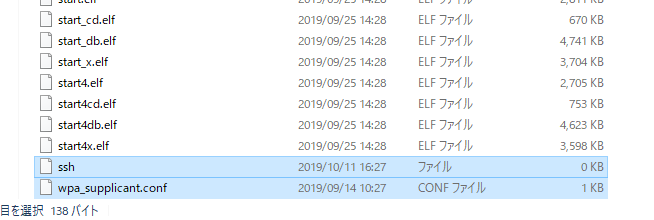

Raspberrypi のディスク作成～接続

 
# Raspberrypi の ディスク作成
Windows 10 で行った。
- Raspbian Buster Lite ダウンロード
- SD Card Formatter、Win32DiskImager のダウンロード
- SD Card Formatter で SD カードをクイックフォーマット
- ダウンロードファイルを解凍して、
  Win32DiskImager で img ファイル(2019-09-26-raspbian-buster-lite.img)を SD カードに書き込む。約２分で完了。

# SSH の有効化
作成されたイメージのルートに `ssh` という空のファイルを配置します。
配置すると初回立ち上げ時に SSH が有効になる。

# WIFI の設定
作成されたイメージのルートに `wpa_supplicant.conf` というファイルを配置すると指定した WIFI が有効になります。

```shell:wpa_supplicant.conf
country=JP
ctrl_interface=DIR=/var/run/wpa_supplicant GROUP=netdev
update_config=1
network={
    ssid="SSID名"
    psk="暗号化キー"
}
```



# Raspberrypi 起動
作成した SD カードを本体に挿入して起動する。

初期のログイン情報は以下になる。
- ホスト名: raspberrypi
- ユーザ名: pi
- パスワード: raspberry

powershell ターミナルより、raspberrypi に SSH 接続する。
Windows 10 より、mDNS （Multicast DNS) が搭載されたため
DNSサーバがいなくても名前解決が可能になった。

```
> ssh pi@raspberrypi
```


