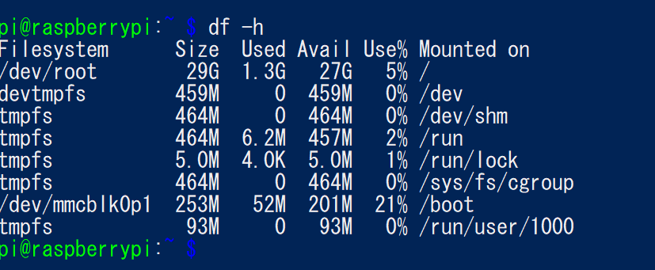
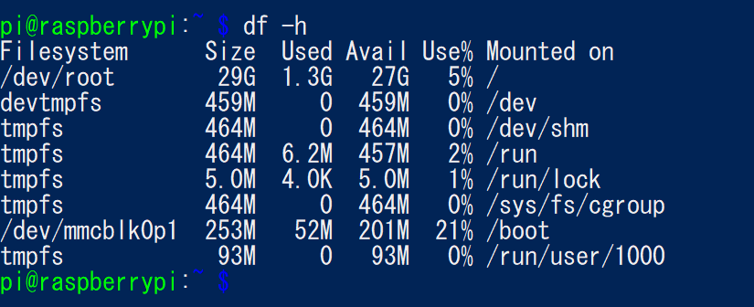

Raspberrypi の初期設定

初期起動直後のディスクサイズ (df -h) 


# raspi-config で初期設定

## ファイルシステム拡張
7.Advanced Options -> A1 Expand Filesystem

ファイルシステム拡張後: 特に変わってない。未使用パーテッションがあると効果ある？


## パスワード変更
## ホスト名変更
2. Network Options -> N1 Hostname
## ローカリゼーション
### I1 Change Locale
登録するロケールの選択
- en_GB.UTF-8 UTF-8
- ja_JP.EUC-JP EUC-JP
- ja_JP.UTF-8 UTF-8

Default locale: ja_JP.UTF-8 UTF-8

### I2 ChangeTimezone
Tokyo

### I3 Change Keyboard
なぜか設定画面が進まず変更できない。直接キーボード繋がないといけない？

# パッケージ更新

```shell
$ sudo apt-get update
$ sudo apt-get upgrade
```

# vim インストール
`vim-tiny` だとつらいので `vim` をインストールを入れる。  

```shell
# 現在入っている vi を確認。
$ dpkg -l | grep vi

# vim-tiny 削除
$ sudo apt-get --purge remove vim-common vim-tiny

# vim インストール
$ sudo apt-get install vim
```

.vimrc 用意
```
set nocompatible
set backspace=indent,eol,start
set autoindent
set nowrap
set ruler
set number
syntax on
```

参考: [Raspberry piのvimを使いやすく](https://okashimoze.jp/blog/raspberry-pi/351.html)

# Ethernet の IP を固定

```sh
$ sudo vi /etc/dhcpcd.conf
# 以下を末尾に追記
interface eth0
static ip_address=10.136.157.125/22
static routers=10.136.156.1
static domain_name_servers=10.136.156.1
```

変更後再起動する

# wifi, bluetooth 無効化

```sh
$ sudo vi /boot/config.txt

# 以下を末尾に追加
# turn wifi and bluetooth off
dtoverlay=pi3-disable-wifi  
dtoverlay=pi3-disable-bt 
```

再起動すると `ifconfig` の結果から `wlan0` が消え、`sudo bluetoothctl` は反応しなくなった。

参考: [Raspberry PiでWi\-Fiを無効にする \- Qiita](https://qiita.com/hawk777/items/a378b884866cd971a5c0)

# 外付け HDD 取付（マウントする）
外付けHDD を 本体に USB接続する。
バスパワータイプの外付けHDDだと電力不足で認識されないことがあるので注意。

```sh
# ディスクが認識されているか確認
$ sudo fdisk -l | grep /dev/sda
Disk /dev/sda: 298.1 GiB, 320072933376 bytes, 625142448 sectors
/dev/sda1      40    409639    409600   200M EFI System
/dev/sda2  409640 624880263 624470624 297.8G Microsoft basic data
```

パーテッション設定
```sh
# パーテッション設定開始
$ sudo fdisk /dev/sda

# パーテッション削除
$ Command (m for help): d
Partition number (1,2, default 2):

Partition 2 has been deleted.

$ Command (m for help): d
Selected partition 1
Partition 1 has been deleted.

# パーテッション確認
$ Command (m for help): p
Disk /dev/sda: 298.1 GiB, 320072933376 bytes, 625142448 sectors
Disk model: HDPC-U
Units: sectors of 1 * 512 = 512 bytes
Sector size (logical/physical): 512 bytes / 512 bytes
I/O size (minimum/optimal): 512 bytes / 512 bytes
Disklabel type: gpt
Disk identifier: 38C1AC3F-AEED-46D0-A8E2-53B993C730A2

# パーテッション追加
$ Command (m for help): n
Partition number (1-128, default 1):
First sector (34-625142414, default 2048):
Last sector, +/-sectors or +/-size{K,M,G,T,P} (2048-625142414, default 625142414):

Created a new partition 1 of type 'Linux filesystem' and of size 298.1 GiB.

# パーテッション確認
$ Command (m for help): p
Disk /dev/sda: 298.1 GiB, 320072933376 bytes, 625142448 sectors
Disk model: HDPC-U
Units: sectors of 1 * 512 = 512 bytes
Sector size (logical/physical): 512 bytes / 512 bytes
I/O size (minimum/optimal): 512 bytes / 512 bytes
Disklabel type: gpt
Disk identifier: 38C1AC3F-AEED-46D0-A8E2-53B993C730A2

Device     Start       End   Sectors   Size Type
/dev/sda1   2048 625142414 625140367 298.1G Linux filesystem

# 変更確定
$ Command (m for help): w
The device contains hybrid MBR -- writing GPT only. You have to sync the MBR manually.

The partition table has been altered.
Calling ioctl() to re-read partition table.
Syncing disks.
```

ext4 でフォーマット
```sh
$ sudo mkfs.ext4 /dev/sda1
mke2fs 1.44.5 (15-Dec-2018)
Creating filesystem with 78142545 4k blocks and 19537920 inodes
Filesystem UUID: dd753908-4a3e-4820-b302-a2c2bf9282d6
Superblock backups stored on blocks:
        32768, 98304, 163840, 229376, 294912, 819200, 884736, 1605632, 2654208,
        4096000, 7962624, 11239424, 20480000, 23887872, 71663616

Allocating group tables: done
Writing inode tables: done
Creating journal (262144 blocks): done
Writing superblocks and filesystem accounting information: done
```

外付けHDDのマウントポイントを作成する
```
$ sudo mkdir /mnt/hdd1
```

外付けHDD の UUID を調べる
```
$ sudo blkid /dev/sda1
/dev/sda1: UUID="dd753908-4a3e-4820-b302-a2c2bf9282d6" TYPE="ext4" PARTUUID="6aea22ef-08ac-2c43-b663-3742afbaa9ce"
```

/etc/fstab を編集する。正しく設定しないと emergency mode になるようなので慎重に行う。
```sh
# バックアップ
$ cd /etc
$ sudo cp fstab fstab.bak

# fstab を編集してマウント設定追加
$ sudo vim fstab
# デバイス名 マウントポイント ファイルシステム オプション dump指定 fsck指定
UUID=dd753908-4a3e-4820-b302-a2c2bf9282d6 /mnt/hdd1 ext4 nofail 0 0

# 再起動
$ sudo reboot
```

再起動後マウントされているかチェック
```
$ df | grep /mnt/hdd1
/dev/sda1        306615548   65564 290905092    1% /mnt/hdd1
```

参考: [Raspberry Pi3で外付けHDDをマウントする \- 新しいノートブック](http://sooch.hatenablog.com/entry/2017/03/26/061032)

# samba

```sh
# 途中 dhcp-client のインストールを促されるが行わない
$ sudo apt-get install samba

$ smbd -V
Version 4.9.5-Debian
```

共有ディレクトリ作成
```sh
$ sudo mkdir /mnt/hdd1/shared

# パーミッション変更
$ sudo chmod 777 /mnt/hdd1/shared/

```

設定ファイルを更新。 shared というディレクトリ名で公開
```sh
$ sudo vi /etc/samba/smb.conf
# 以下を最後に追加
[shared]
comment = Raspberry Pi
path = /mnt/hdd1/shared
guest ok = yes
read only = no
browseable = yes
force user = pi
```

サービス再起動
```
# sudo service smbd restart
```

参考: [Raspberry Pi 3 Model B\+ に samba をインストールする \- Qiita](https://qiita.com/bu_itamochi/items/d413d24d68f144949c57)


